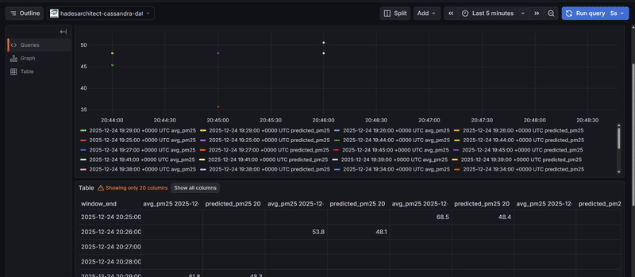
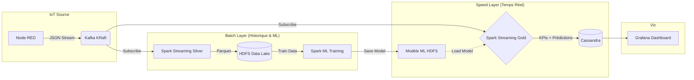
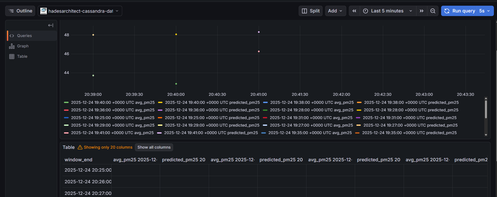

# 🏙️ CityPulse - Smart City Real-Time Analytics & ML

[](https://www.scala-lang.org/)
[](https://spark.apache.org/)
[](https://kafka.apache.org/)
[](https://cassandra.apache.org/)
[](https://spark.apache.org/mllib/)
[](LICENSE)

> **Plateforme Big Data End-to-End** intégrant ingestion IoT, traitement distribué en temps réel, stockage hybride et **Machine Learning** pour la prédiction de pollution urbaine.

---
**Dashboard Grafana:**

---

## 🎯 Vue d'ensemble

**CityPulse** est une réponse technologique aux défis de gestion urbaine. La plateforme simule et ingère des flux de données IoT (Trafic & Pollution) pour fournir une vision 360° de la ville.

Elle implémente une **Architecture Lambda Modernisée** capable de :
1.  **Ingérer** des flux à haute fréquence via Kafka.
2.  **Historiser** les données brutes et nettoyées (Data Lake HDFS).
3.  **Entraîner** un modèle d'Intelligence Artificielle sur l'historique (Batch).
4.  **Prédire & Alerter** en temps réel sur les niveaux de pollution futurs (Streaming).

### Intelligence Artificielle & Logique Métier
Le système utilise **Spark MLlib** (Régression Linéaire) pour prédire le taux de PM2.5 en fonction de la densité du trafic.

**Règle d'Alerting Temps Réel :**
```sql
IF (Pollution_Predict > 80 µg/m³ AND Densité_Trafic > 40) 
THEN ALERTE = 'CRITIQUE'
ELSE IF (Pollution_Predict > 50 µg/m³) 
THEN ALERTE = 'WARNING'
ELSE ALERTE = 'NORMAL'
```

---

## Architecture Technique



---

## 🛠️ Stack Technique

| Domaine | Technologie | Version | Rôle |
|---------|-------------|---------|------|
| **`Ingestion`** | **Apache Kafka** | 7.6 (KRaft) | Bus d'événements haute performance (No Zookeeper) |
| **`Simulation`** | **Node-RED** | 3.1 | Générateur de trafic IoT réaliste |
| **`Compute`** | **Apache Spark** | 3.3.0 | Moteur unifié pour Streaming et Batch ML |
| **`ML Engine`** | **Spark MLlib** | 3.3.0 | Algorithme de Régression Linéaire Distribué |
| **`Stockage Froid`** | **Hadoop HDFS** | 3.2.1 | Data Lake (Format Parquet partitionné) |
| **`Stockage Chaud`** | **Cassandra** | 4.1 | Base NoSQL Time-Series pour le temps réel |
| **`Visualisation`** | **Grafana** | Latest | Tableau de bord décisionnel |
| **`Infra`** | **Docker** | 24+ | Déploiement "Infrastructure as Code" |

---

## Installation & Démarrage

### 1. Prérequis
*   Docker Desktop (Linux/Windows WSL2/Mac).
*   4 Go de RAM dédiés à Docker minimum.

### 2. Démarrage de l'Infrastructure
```bash
git clone https://github.com/8sylla/citypulse.git
cd citypulse

# Lancer le cluster complet (Kafka, Spark Master+Workers, HDFS, Cassandra...)
docker-compose up -d
```

### 3. Initialisation des Ressources
Une fois les conteneurs actifs (vérifier via `docker ps`), initialisez les bases de données :

```bash
# 1. Création Topics Kafka
docker exec citypulse-kafka kafka-topics --create --topic traffic-raw --bootstrap-server localhost:9092 --partitions 1 --replication-factor 1

docker exec citypulse-kafka kafka-topics --create --topic pollution-raw --bootstrap-server localhost:9092 --partitions 1 --replication-factor 1

# 2. Création Table Cassandra (Avec colonne prédiction ML)
docker exec -it citypulse-cassandra cqlsh -e "
  CREATE KEYSPACE IF NOT EXISTS citypulse WITH replication = {'class': 'SimpleStrategy', 'replication_factor': 1};
  USE citypulse;
  CREATE TABLE district_stats (
      district text, window_end timestamp, avg_speed double, max_density int, 
      avg_pm25 double, predicted_pm25 double, alert_level text,
      PRIMARY KEY (district, window_end)
  ) WITH CLUSTERING ORDER BY (window_end DESC);"

# 3. Structure HDFS
docker exec citypulse-namenode hdfs dfs -mkdir -p /data/silver /models
```

---

## ▶️ Exécution du Pipeline (De A à Z)

### Étape 1 : Activer la Source IoT
1.  Ouvrez **Node-RED** : [http://localhost:1880](http://localhost:1880)
2.  Importez le flux `node-red/flows.json`.
3.  Cliquez sur **Deploy** et activez les injecteurs pour simuler le trafic.

### Étape 2 : Compilation & Déploiement
Compilez le code Scala en un "Fat JAR" et envoyez-le au cluster Spark.
```bash
sbt clean assembly
docker cp target/scala-2.12/CityPulse-assembly-1.0.jar citypulse-spark-master:/tmp/app.jar
```

### Étape 3 : Génération de l'Historique (Silver Layer)
Nous devons d'abord accumuler des données pour entraîner l'IA.
```bash
docker exec -d citypulse-spark-master /spark/bin/spark-submit \
  --class citypulse.SilverProcessing \
  --master spark://citypulse-spark-master:7077 \
  --packages org.apache.spark:spark-sql-kafka-0-10_2.12:3.3.0 \
  /tmp/app.jar
```
*⏳ Laissez tourner 5 à 10 minutes pour remplir le Data Lake.*

### Étape 4 : Entraînement du Modèle IA (Batch)
Une fois les données suffisantes, nous entraînons le modèle de prédiction.
```bash
docker exec -it citypulse-spark-master /spark/bin/spark-submit \
  --class citypulse.ModelTraining \
  --master spark://citypulse-spark-master:7077 \
  /tmp/app.jar
```
*Succès si : `>>> MODÈLE ENTRAINÉ ET SAUVEGARDÉ ! <<<`*

### Étape 5 : Lancement du Temps Réel + Prédictions (Gold Layer)
Le job final qui lit Kafka, charge le modèle IA, prédit et écrit dans Cassandra.

```bash
docker exec -it citypulse-spark-master /spark/bin/spark-submit \
  --class citypulse.GoldAggregations \
  --master spark://citypulse-spark-master:7077 \
  --packages org.apache.spark:spark-sql-kafka-0-10_2.12:3.3.0,com.datastax.spark:spark-cassandra-connector_2.12:3.3.0 \
  --conf spark.cassandra.connection.host=citypulse-cassandra \
  --conf spark.sql.shuffle.partitions=3 \
  /tmp/app.jar
```

---

## Visualisation (Grafana)

1.  Accédez à [http://localhost:3000](http://localhost:3000) (Login: `admin` / `citypulse`).
2.  Configurez la Datasource Cassandra (`citypulse-cassandra:9042`).
3.  Créez un dashboard avec la requête suivante pour comparer Réalité vs IA :

```sql
SELECT window_end, avg_pm25, predicted_pm25 
FROM district_stats 
WHERE district = 'Centre' 
ALLOW FILTERING
```

**Résultat :**


---

## 📁 Structure du Projet

```bash
citypulse/
├── docker-compose.yml           # Orchestration complète
├── src/main/scala/citypulse/
│   ├── SilverProcessing.scala   # Ingestion & Stockage (Batch Layer Prep)
│   ├── ModelTraining.scala      # Machine Learning (Spark MLlib)
│   └── GoldAggregations.scala   # Streaming + Inference + Cassandra
├── build.sbt                    # Dépendances (Spark SQL, Streaming, ML, Kafka)
├── node-red/flows.json          # Simulation IoT
└── README.md                    # Documentation
```

---

## 👨‍💻 Auteur

**SYLLA N'faly**  
*Élève Ingénieur - Passionné par le Data Engineering & Big Data*  
Projet réalisé dans le cadre d'un module académique avancé.

