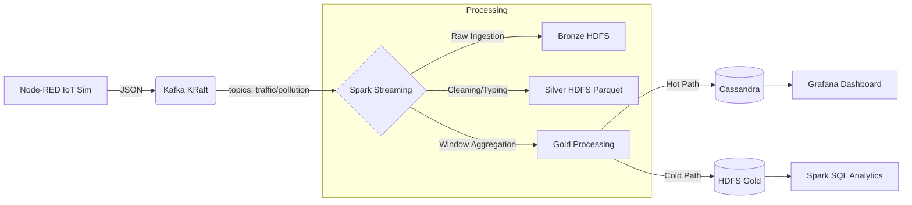

# 🏙️ CityPulse - Smart City Real-Time Analytics

[](https://www.scala-lang.org/)
[](https://spark.apache.org/)
[](https://kafka.apache.org/)
[](https://www.docker.com/)
[](LICENSE)

> **Plateforme Big Data End-to-End** pour la corrélation en temps réel du trafic routier et de la pollution urbaine via une Architecture Lambda Modernisée.

---


## 🎯 Vue d'ensemble

**`CityPulse`** répond à une problématique urbaine critique : le cloisonnement des données.
La plateforme ingère des flux IoT simulés, les traite via **`Apache Spark Structured Streaming`**, et fournit une double vue :

> 1.  **`Temps Réel (Speed Layer) :`** Alertes immédiates sur tableau de bord (Grafana/Cassandra).
> 2.  **`Historique (Batch Layer) :`** Analyse long terme via Data Lake (HDFS/Parquet).

### 🚦 Logique Métier (Alerting)
Le système croise les données toutes les minutes pour détecter les zones critiques :
```sql
IF (Pollution_PM25 > 80 µg/m³ AND Densité_Trafic > 40 véh/min) 
THEN ALERTE = 'CRITIQUE'
ELSE IF (Pollution_PM25 > 50 µg/m³) 
THEN ALERTE = 'WARNING'
```

---

## Architecture

L'architecture repose sur le pattern **Lambda**, entièrement conteneurisée.



---

## Stack Technique

| Composant | Technologie | Version | Description |
|-----------|-------------|---------|-------------|
| **Ingestion** | **Apache Kafka** | 7.6 (KRaft) | Bus d'événements (Sans Zookeeper) |
| **Simulation** | **Node-RED** | 3.1 | Générateur de flux IoT (HTTP/Kafka) |
| **Processing** | **Apache Spark** | 3.3.0 | Moteur de calcul distribué (Scala 2.12) |
| **Stockage Froid** | **HDFS** | 3.2.1 | Data Lake distribué (Namenode/Datanode) |
| **Stockage Chaud** | **Cassandra** | 4.1 | Base NoSQL orientée colonnes |
| **Visualisation** | **Grafana** | Latest | Dashboarding temps réel |
| **Orchestration** | **Docker** | 24+ | Conteneurisation complète |

---

## 💻 Prérequis

Assurez-vous d'avoir installé :
*   **Docker Desktop** (avec WSL2 sur Windows).
*   **Java 11** (recommandé pour Spark 3.3).
*   **SBT** (Scala Build Tool) pour la compilation.

```bash
# Vérification
java -version
sbt sbtVersion
docker-compose version
```

---

## Installation & Démarrage

### 1. Cloner et Lancer l'Infrastructure
```bash
git clone https://github.com/8sylla/citypulse.git
cd citypulse

# Démarrer le cluster (Kafka, Spark, HDFS, Cassandra, Grafana, Node-RED)
docker-compose up -d
```
*Patientez 1 à 2 minutes que les services s'initialisent.*

### 2. Initialiser les Ressources (One-Time Setup)

**Créer les Topics Kafka :**
```bash
docker exec citypulse-kafka kafka-topics --create --topic traffic-raw --bootstrap-server localhost:9092 --partitions 1 --replication-factor 1

docker exec citypulse-kafka kafka-topics --create --topic pollution-raw --bootstrap-server localhost:9092 --partitions 1 --replication-factor 1
```

**Créer le Schéma Cassandra :**
```bash
docker exec -it citypulse-cassandra cqlsh -e "
  CREATE KEYSPACE IF NOT EXISTS citypulse WITH replication = {'class': 'SimpleStrategy', 'replication_factor': 1};
  USE citypulse;
  CREATE TABLE district_stats (
      district text, window_end timestamp, avg_speed double, max_density int, avg_pm25 double, alert_level text,
      PRIMARY KEY (district, window_end)
  ) WITH CLUSTERING ORDER BY (window_end DESC);"
```

**Préparer HDFS :**
```bash
docker exec citypulse-namenode hdfs dfs -mkdir -p /data/bronze /data/silver /data/gold
```

---

## ▶️ Exécution du Pipeline

### Étape 1 : Activer la Simulation (Node-RED)
1.  Accédez à [http://localhost:1880](http://localhost:1880).
2.  Importez le flux `node-red/flows.json` (fourni dans le repo).
3.  Cliquez sur **`Deploy`** et activez les injecteurs.
4.  *Vérification :* `docker exec citypulse-kafka kafka-console-consumer --bootstrap-server localhost:9092 --topic traffic-raw`

### Étape 2 : Compiler le Code Scala
```bash
# À la racine du projet
sbt clean assembly
# Copier le JAR généré vers le conteneur Spark
docker cp target/scala-2.12/CityPulse-assembly-1.0.jar citypulse-spark-master:/tmp/app.jar
```

### Étape 3 : Lancer les Jobs Spark
Nous utilisons `spark-submit` directement dans le conteneur master.

**A. Silver Layer (Nettoyage & Parquet) :**
```bash
docker exec -d citypulse-spark-master /spark/bin/spark-submit \
  --class citypulse.SilverProcessing \
  --master spark://citypulse-spark-master:7077 \
  --packages org.apache.spark:spark-sql-kafka-0-10_2.12:3.3.0 \
  /tmp/app.jar
```

**B. Gold Layer (Analytics & Alerting) :**
```bash
docker exec -it citypulse-spark-master /spark/bin/spark-submit \
  --class citypulse.GoldAggregations \
  --master spark://citypulse-spark-master:7077 \
  --packages org.apache.spark:spark-sql-kafka-0-10_2.12:3.3.0,com.datastax.spark:spark-cassandra-connector_2.12:3.3.0 \
  --conf spark.cassandra.connection.host=citypulse-cassandra \
  /tmp/app.jar
```

---

## 📊 Visualisation

### Dashboard Grafana
1.  Accédez à [http://localhost:3000](http://localhost:3000) (Login: `admin` / `citypulse`).
2.  Configuration Datasource :
    *   **Type :** Apache Cassandra (HadesArchitect).
    *   **Host :** `citypulse-cassandra:9042`.
    *   **Keyspace :** `citypulse`.
3.  Importez le dashboard JSON fourni dans `grafana/dashboard.json`.

**Résultat :** Vous verrez les courbes de pollution et de trafic se mettre à jour toutes les 30 secondes.

### Requêtage Ad-Hoc (Spark SQL)
Pour analyser l'historique stocké sur HDFS :
```bash
docker exec -it citypulse-spark-master /spark/bin/spark-sql
> SELECT district, avg(speed_kmh) FROM parquet.`hdfs://citypulse-namenode:9000/data/silver/traffic` GROUP BY district;
```

---

## 📁 Structure du Projet

```bash
citypulse/
├── docker-compose.yml           # Orchestration Infrastructure
├── src/
│   └── main/scala/citypulse/
│       ├── BronzeIngestion.scala   # Ingestion Raw (Optionnel)
│       ├── SilverProcessing.scala  # Parsing, Cleaning, Parquet
│       └── GoldAggregations.scala  # Windowing, Join, Cassandra
├── build.sbt                    # Configuration compilation Scala
├── data/                        # Volumes persistants (exclus du git)
└── README.md                    # Documentation
```

---

## 👨‍💻 Auteur

**SYLLA N'faly**  
*Élève Ingénieur avec une grande passion pour Data & Big Data*  
Projet réalisé dans le cadre du module Data Engineering.

